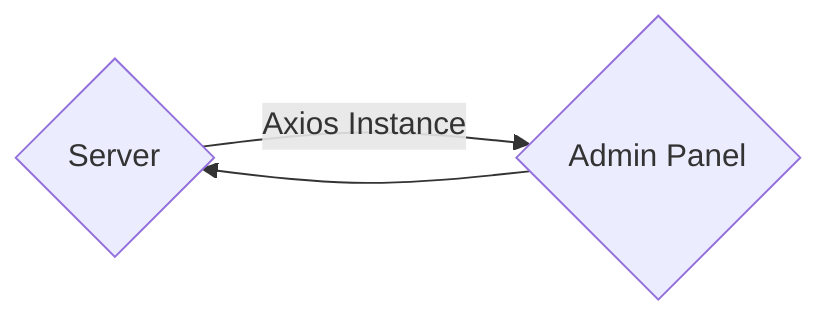

# Making a Plugin


## Plugin Creation
Create a new Strapi project or use an existing one

Npm
```bash
npx create-strapi-app@latest my-project --quickstart
```
Yarn
```bash
yarn create strapi-app my-project --quickstart
```

Then set up your project with the default admin user.

Once set up you will generate the default plugin schema using

```bash
yarn strapi generate plugin
```

After you enter your plugin name it will create the schema for your plugin and provides you. You will then have to create the `./config/plugins.js` file and add the provided code

```js
module.exports = {
  // ...
  'test-plugin': {
    enabled: true,
    resolve: './src/plugins/test-plugin'
  },
  // ...
}
```

> Note: this plugin will live within the Strapi project however if this is a plugin you plan to use outside the project I would recommend that you move your plugin file outside your strapi project and change `resolve` to the absolute directory of your plugin then you can maintain it outside this "dummy" Strapi project


## Plugin Setup

Once you have generated your plugin you can start the server in 2 different ways

What you need to understand is Strapi itself is headless, the admin panel is completely separate from the server.



Firstly you can run:

```bash
yarn develop
```

This will ONLY auto reload when changes are made to the server and if you are only doing development in the `./server` directory of your plugin this will be faster

If you are doing development on BOTH the `./server` and `./admin` directories you will want to run

```bash
yarn develop --watch-admin
```

This will host the admin panel and server separately. The server will be on `localhost:1337` as always _however_ the admin panel will now have hot reloading but this will only be accessible on `localhost:8080/admin` What is important to note is that the core server is still going to be hosted on `localhost:1337` meaning if you need to make requests it will be on `localhost:1337` `:8000` is ONLY for the admin panel hot reloading.
