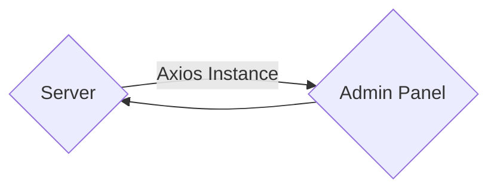

# Passing Data Between Server and Admin

[Real Life Example](https://github.com/excl-networks/strapi-plugin-generate-schema/tree/master/admin)

When developing a plugin you most likely want to pass data from the `/server` to `/admin` as within `/server` you have access to the Strapi object and can do db queries whereas in `/admin` you can't.

We can do this using the admin's axios instance 

You can import the `axiosInstance` by 

```js
import axiosInstance from '../../src/utils/axiosInstance';
```

What you need to understand is Strapi itself is headless, the admin panel is completely separate from the server.



First you need to make an Admin Route

This is just like a normal route that you would have for any controller but you have the `type: 'admin'` which hides it from the general router and allows you access it from the admin panel

```js
// /server/routes
module.exports = {
  type: 'admin', // Important
  routes: [
    {
      method: 'GET',
      path: '/foobar',
      handler: 'foobar.index',
      config: {
        policies: [],
        auth: false,
      },
    }
    // ...
  ],
};
```

After you have the route setup and have it hooked up to a controller you will then move over to the `/admin` side of things

Inside of `./admin/src/api/foobar.js` you can make a new file to help manage all the different requests

```js
import axiosInstance from '../../src/utils/axiosInstance';

const foobarRequests = {
  getFoobar: async () => {
    const data = await axiosInstance.get(`/your-plugin/foobar`);
    return data;
  },
};
export default foobarRequests;
```

You request your data from `/your-plugin-slug/your-route`

Within your React component you will use `useEffect` to get the data after the component initializes

```js
import schemasRequest from "../../api/foobar";
const [foobar, setFoobar] = useState([]);

  useEffect(() => {
    foobarRequests.getFoobar().then(res => {
      setSchemas(res.data);
    });
  }, [setFoobar]);
```

Now you will have your returned data within `foobar`
