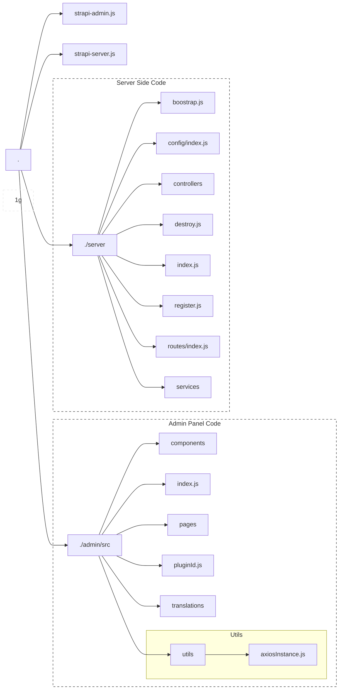

# Plugin Structure

Within your `./src/plugins` folder you will see a new folder with your plugin name

The directory looks something like this:

_Click on the boxes for more info_


I have omitted some files for simplicity, but you can click on any of the boxes for more context. Full file structure can be viewed [here](https://strapi.io/blog/how-to-create-a-strapi-v4-plugin-file-structure-2-6)

# Server Config

This folder is responsible for handling the server configuration. This is how you load and validate the configuration inputted from user within your `./config/plugins.js`

You can get any of these config values wherever you can access the `strapi` object by doing this:
```js
strapi.config.get('plugin.{{your-plugin-slug}}.key.value')
```

> Remember you can do `yarn strapi console` to access the strapi object in a live console and you can type `strapi.config.get('plugin.{{your-plugin-slug}}')` to view your entire plugin's config

# Server Index

This is the entry point of your server; index and will export all of your different folders

# Admin Index

This is the entry point of your admin panel; This will export all of the different components that you have

# Components

This is where you will store your React components to use in `./pages`

# Pages

These will be all of your admin panel pages and tend to correspond with the leftward side tabs

# Plugin Id

This is a helper function to access your plugin id within the admin panel

# Translations

Storage for all of your I18n functions

# Utils

This contains any JS utility functions you may need.
